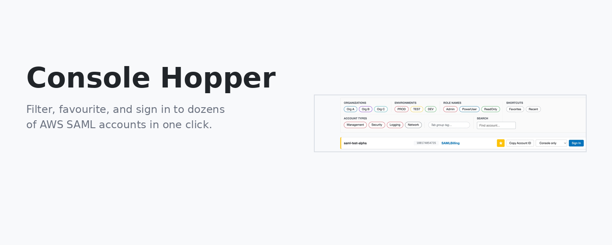
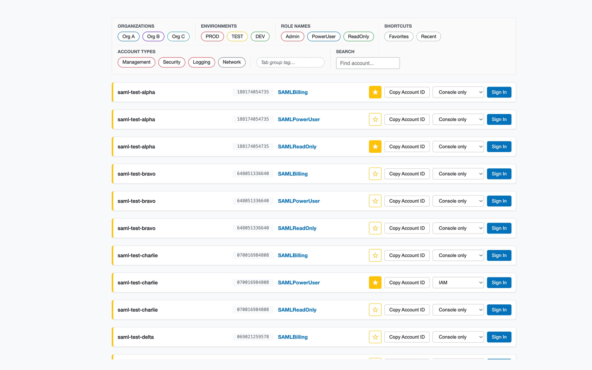
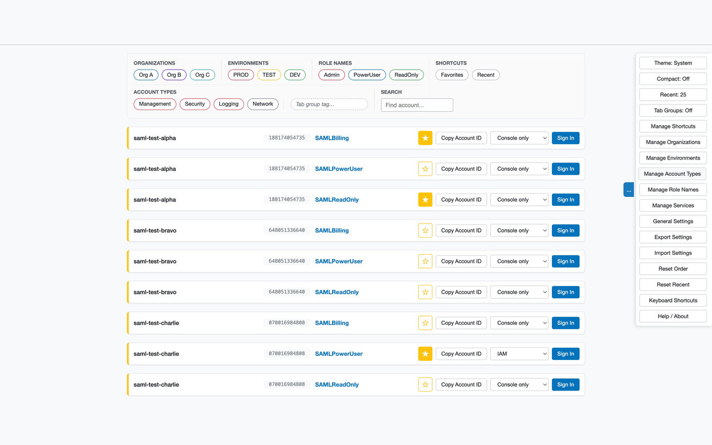
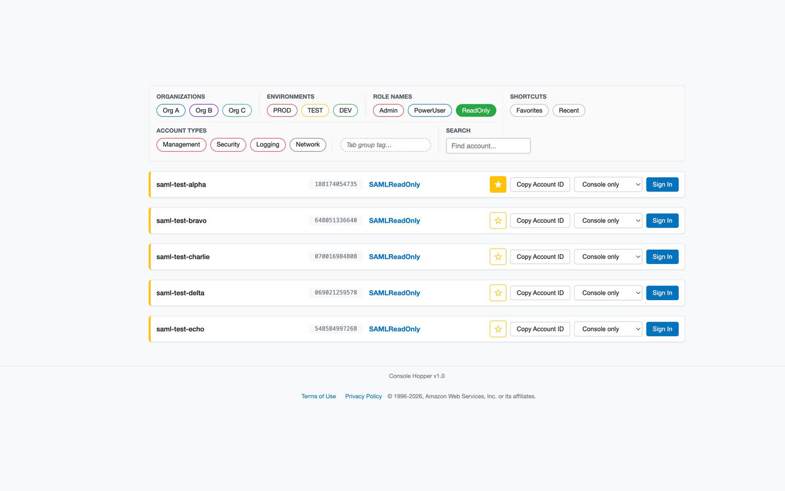
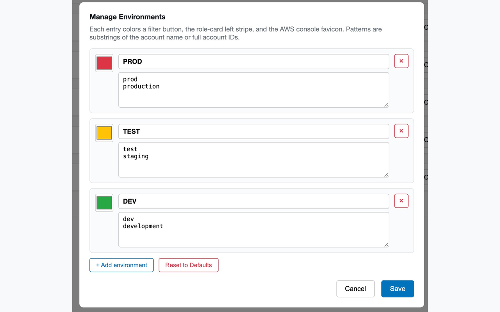

# Console Hopper — Chrome Extension

<p align="center">
  
</p>

> **Hop between AWS consoles fast.** Turn the AWS SAML role picker into
> a filterable launcher; turn a tab strip full of AWS consoles into
> something a human can actually read.

Aimed at anyone signing into many AWS accounts via SAML SSO (consulting
firms, multi-account orgs, anyone with a Control Tower / Landing Zone).

## What it looks like

| The role picker | The side menu |
|---|---|
|  |  |

| Filtering by role | Configuring envs |
|---|---|
|  |  |

## Quick start

1. **Install** — from the Chrome Web Store *(link coming once published)*,
   or load this folder unpacked via `chrome://extensions/`.
2. **Open your AWS SAML sign-in URL** (`https://signin.aws.amazon.com/saml`
   or your IdP's redirect target). The role picker is now Console Hopper.
3. **Configure** — hover the right edge of the page to open the side
   menu, then either:
   - use `Manage Organizations`, `Manage Environments`,
     `Manage Account Types`, `Manage Role Names`, and `General Settings`
     to set things up via the UI, **or**
   - skip ahead by pasting [`samples/landing-zone-example.json`](samples/landing-zone-example.json)
     into `Import Settings` for an AWS Landing-Zone-style starting point,
     then tweak the labels to match your org.

That's it. On first load you'll see a welcome panel with a tour of the
features.

## What it does

- **Filter + search** roles by organisation, environment, account type,
  or role-name keyword, plus full-text search across account name, id,
  and role.
- **Favorites & Recent** — star roles you use often; recent sign-ins
  are tracked automatically (configurable limit).
- **Drag-to-reorder** the role list; the order persists across sessions.
- **Deep-link into a service** — pick EC2 / S3 / IAM / CloudWatch /
  CloudFormation / … before clicking Sign In and land directly in that
  service's console for that role.
- **Coloured console tabs** — env-coloured favicon + account-name title
  prefix, so ten open AWS consoles stay distinguishable.
- **Tab groups** — cluster console tabs by role, by organisation, or by
  a per-ticket override tag using Chrome's native tab groups.
- **Sensitive-sign-in confirmation** — pops a confirmation modal for
  configurable role-name keywords (default: `admin`) or account types.
- **⌘/Ctrl-click Sign In** (also: middle-click, ⌘+Enter) opens the
  resulting AWS console in a new tab.
- **Light / dark / auto theme**, compact mode, keyboard shortcuts
  (`/` or `⌘K` to search, `↑/↓` to navigate, `Enter` to sign in).
- **Export / Import settings** as JSON to share configuration with a
  teammate.

Everything is **org-agnostic** — no vendor names are hard-coded. The
defaults are generic placeholders (`Org A`, `Org B`, `Org C`, etc.)
that you rename to match your real organisations, environments, and
account types.

## Permissions

| Permission | Why |
|---|---|
| `storage` | Persist user preferences in `chrome.storage.local`. |
| `tabs`, `tabGroups` | Drop new console tabs into Chrome tab groups. |
| Host: `*.signin.aws.amazon.com/saml`, `*.console.aws.amazon.com/*` | Enhance the role picker; decorate console tabs. |

No `<all_urls>`, no remote code, no telemetry, no external requests of
any kind. Everything stays in your browser.

## Privacy

Console Hopper does not collect, transmit, or share any data. Full
policy: [`PRIVACY.md`](PRIVACY.md).

## Project structure

```
console-hopper/
├── manifest.json           # Manifest V3
├── content.js              # Main script (injected into the SAML page)
├── console-decorator.js    # Sets favicon + title on AWS console pages
├── background.js           # Service worker (tab grouping)
├── lib/jquery.min.js       # Bundled jQuery 3.7.1
├── icons/                  # icon16/32/48/128.png
├── samples/                # Importable starter configs (e.g. AWS LZ)
├── store-assets/           # Screenshots + promo tiles (not in submission zip)
├── build.sh                # Build the Chrome Web Store submission zip
├── PRIVACY.md              # Privacy policy
├── STORE_LISTING.md        # Chrome Web Store form values + checklist
└── README.md
```

## Install from source

1. `chrome://extensions/`
2. Enable **Developer mode** (top right).
3. **Load unpacked** → select this directory.

## Building a release zip

```bash
./build.sh
```

Produces `console-hopper.zip` in the repo root, containing only the
files that ship in the installed extension (no docs, no
`store-assets/`, no `samples/`, no `.git/`). Prints the file list and
size so a typo in the excludes can't silently leak files.

See [`STORE_LISTING.md`](STORE_LISTING.md) for the Chrome Web Store
submission values (name, summary, description, permissions
justifications, category, privacy answers) and the pre-submission
checklist.

## Contributing

Issues and pull requests welcome at
<https://github.com/tomekklas/console-hopper>.

## License

This extension is not affiliated with Amazon Web Services. "AWS" is a
trademark of Amazon.com, Inc.
