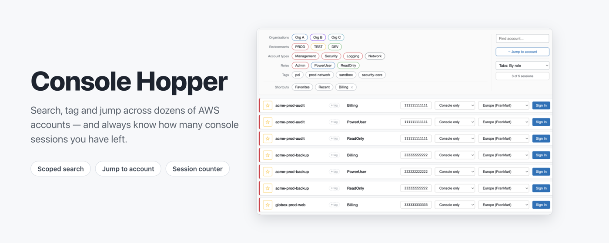
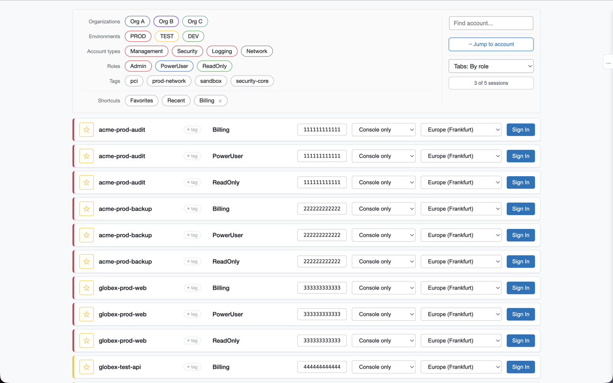
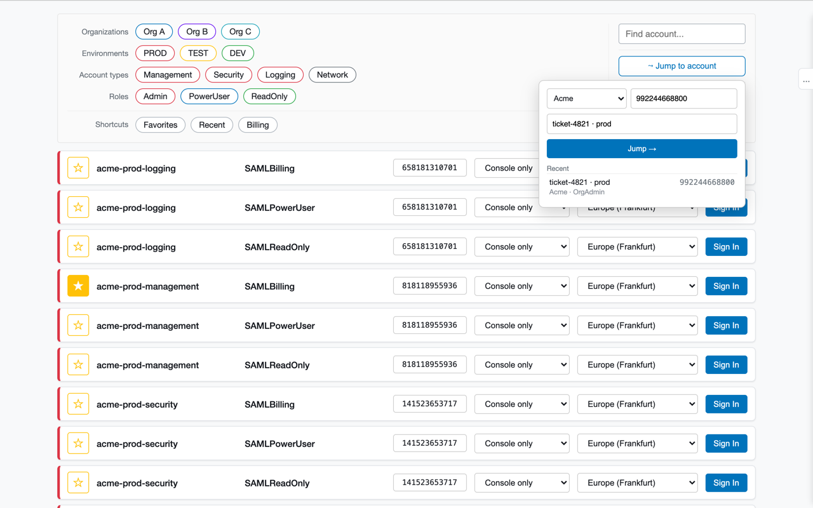
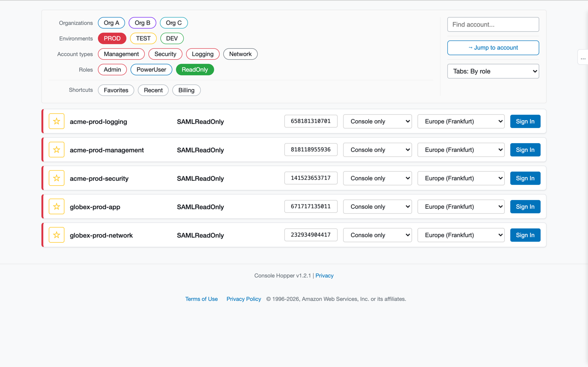
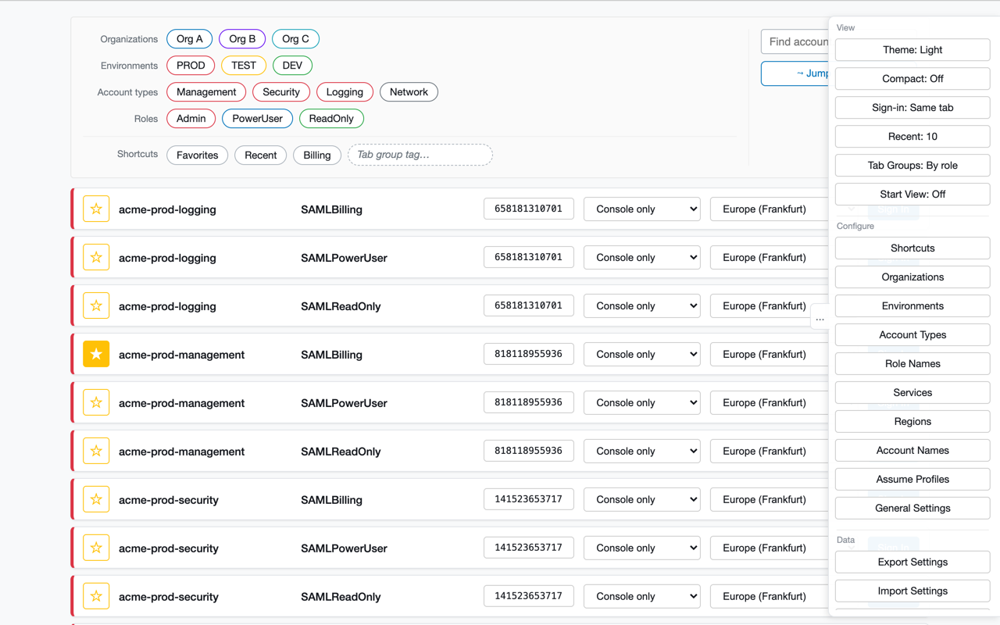

# Console Hopper — Chrome Extension

<p align="center">
  
</p>

> **Hop between AWS consoles fast.** Turn the AWS SAML role picker into
> a filterable launcher; turn a tab strip full of AWS consoles into
> something a human can actually read.

Aimed at anyone signing into many AWS accounts via SAML SSO (consulting
firms, multi-account orgs, anyone with a Control Tower / Landing Zone).

## What it looks like

| The role picker | Jump to account |
|---|---|
|  |  |

| Filtering by role | The side menu |
|---|---|
|  |  |

## Quick start

1. **Install** — from the Chrome Web Store *(link coming once published)*,
   or build from source (`npm install && npm run build`) and load the
   `dist/` folder unpacked via `chrome://extensions/`.
2. **Open your AWS SAML sign-in URL** (`https://signin.aws.amazon.com/saml`
   or your IdP's redirect target). The role picker is now Console Hopper.
3. **Configure** — hover the right edge of the page to open the side
   menu, then either:
   - use `Organizations`, `Environments`, `Account Types`, `Role Names`,
     and `General Settings` (under **Configure**) to set things up via
     the UI, **or**
   - skip ahead by pasting [`samples/landing-zone-example.json`](samples/landing-zone-example.json)
     into `Import Settings` for an AWS Landing-Zone-style starting point,
     then tweak the labels to match your org.

That's it. On first load you'll see a welcome panel with a tour of the
features.

## What it does

- **Filter + search** roles by organisation, environment, account type,
  or role-name keyword, plus full-text search across account name, id,
  and role.
- **Start View** — save your current filters (or one-click your Favorites) as
  the view the picker opens with, re-applied automatically on every load.
- **Rename accounts** — map specific account IDs to a friendly name via
  `Account Names`; the custom name replaces the AWS name in the
  list and drives filtering, grouping, and tab titles.
- **Favorites & Recent** — star roles you use often; recent sign-ins
  are tracked automatically (configurable limit).
- **Drag-to-reorder** the role list; the order persists across sessions.
- **Deep-link into a service** — pick EC2 / S3 / IAM / CloudWatch /
  CloudFormation / … before clicking Sign In and land directly in that
  service's console for that role.
- **Per-sign-in region** — each role row has a region dropdown, so you
  choose which AWS region a sign-in lands in. Defaults to your region
  (`General Settings`) and remembers your last pick per role; untick
  **Remember the region I pick per role** to make every row always open
  on the default instead. The offered list is editable via `Regions`.
- **Jump to account (role chaining)** — for accounts you can only reach
  by assuming a role from a hub, including accounts that aren't in your
  role list at all. Configure each org once via `Jump Profiles`
  (`Org name | hub account | role to assume | region`; add `/HubRole` to
  the hub account when it has more than one role, and the region is
  optional). The **⤳ Jump to account** button then signs into the hub and
  opens AWS's Switch Role pre-filled — with a region to land in, an
  optional session label that becomes the new tab's title, and one-click
  recents you can pin.
- **Lands where you chose** — AWS puts a switched role in whatever region
  it likes; Console Hopper corrects it to the one you picked.
- **Skips AWS's session picker** — with several console sessions open, AWS
  interrupts a jump to ask which to switch from, and doesn't reliably
  pre-select the right one. Console Hopper picks the hub session and
  submits the pre-filled form, but only during a jump you started and only
  when the match is unambiguous.
- **Click-to-copy account ID** — click the account-ID button on any row
  to copy the 12-digit id.
- **Coloured console tabs** — env-coloured favicon + account-name title
  prefix, so ten open AWS consoles stay distinguishable.
- **Tab groups** — cluster console tabs by role, by organisation, or by
  a per-ticket override tag using Chrome's native tab groups.
- **Sensitive-sign-in confirmation** — pops a confirmation modal for
  configurable role-name keywords (default: `admin`) or account types.
- **New-tab sign-in** — ⌘/Ctrl-click, middle-click, or ⌘+Enter opens the
  console in a new tab. A `Sign-in` side-menu option sets the default,
  and the modifier inverts it.
- **Active AWS sessions** — AWS allows five concurrent console sessions
  per browser profile and normally only tells you once you're stuck. A
  counter at the foot of the right column turns amber with one slot left
  and red when full; open it for every session's account, role, region,
  tab group, age, time left and open tabs — and sign any one of them out
  to free a slot. Session metadata only; cookie contents are never read.
- **Clear AWS Sessions** — one click signs you out of all open AWS
  consoles by clearing AWS auth cookies (your console favourites and
  settings are kept).
- **Light / dark / auto theme**, compact mode, keyboard shortcuts
  (`/` or `⌘K` to search, `↑/↓` to navigate, `Enter` to sign in).
- **Export / Import settings** as JSON to share configuration with a
  teammate.

Everything is **org-agnostic** — no vendor names are hard-coded. The
defaults are generic placeholders (`Org A`, `Org B`, `Org C`, etc.)
that you rename to match your real organisations, environments, and
account types.

## Permissions

| Permission | Why |
|---|---|
| `storage` | Persist user preferences in `chrome.storage.local`. |
| `tabs`, `tabGroups` | Drop new console tabs into Chrome tab groups. |
| `cookies` | Delete AWS authentication cookies for the **Clear AWS Sessions** button. Cookies are only deleted — never read or transmitted. |
| Host: `*.aws.amazon.com/*` (incl. `signin.` and `console.`) | Enhance the role picker, decorate console tabs, and clear AWS session cookies. |

No `<all_urls>`, no remote code, no telemetry, no third-party requests of
any kind. Everything stays in your browser.

## Privacy

Console Hopper does not collect, transmit, or share any data. Full
policy: [`PRIVACY.md`](PRIVACY.md).

## Project structure

```
console-hopper/
├── manifest.json           # Manifest V3
├── src/content/            # Content-script ES modules (bundled → dist/content.js)
│   ├── index.js            #   main script injected into the SAML page
│   ├── dom.js              #   minimal jQuery-subset DOM shim
│   └── util.js             #   pure helpers (escaping, matchers, parsing)
├── console-decorator.js    # Sets favicon + title on AWS console pages
├── background.js           # Service worker (tab grouping)
├── icons/                  # icon16/32/48/128.png
├── samples/                # Importable starter configs (e.g. AWS LZ)
├── store-assets/           # Screenshots + promo tiles (not in submission zip)
├── package.json            # Dev tooling (esbuild build, ESLint, vitest)
├── scripts/build.mjs       # Build the Chrome Web Store submission zip
├── test/                   # vitest unit tests (util + dom shim)
├── PRIVACY.md              # Privacy policy
├── STORE_LISTING.md        # Chrome Web Store form values + checklist
└── README.md
```

## Install from source

1. `npm install` then `npm run build` (produces `dist/`).
2. `chrome://extensions/`
3. Enable **Developer mode** (top right).
4. **Load unpacked** → select the `dist/` directory.

## Building a release zip

```bash
npm install   # first time only
npm run build
```

Bundles a minified copy of the extension under `dist/` and zips it into
`console-hopper.zip` in the repo root, containing only the files that ship in
the installed extension (no docs, no `store-assets/`, no `samples/`, no
`.git/`). Validates `manifest.json` and prints the file list and size so a typo
in the excludes can't silently leak files.

The editable source stays at the repo root — load it unpacked via
`chrome://extensions/` for development, or load `dist/` to test the built
package.

See [`STORE_LISTING.md`](STORE_LISTING.md) for the Chrome Web Store
submission values (name, summary, description, permissions
justifications, category, privacy answers) and the pre-submission
checklist.

## Contributing

Issues and pull requests welcome at
<https://github.com/tomekklas/console-hopper>.

## License

Released under the [MIT License](LICENSE).

## Trademarks

This extension is not affiliated with Amazon Web Services. "AWS" is a
trademark of Amazon.com, Inc.
